<!DOCTYPE html>
<html lang="es">
<head>
  <meta charset="UTF-8" />
  <meta name="viewport" content="width=device-width, initial-scale=1.0" />
  <title>Fórmula 1 </title>
  <link rel="stylesheet" href="style.css" />
</head>
<body>
  <header>
    <h1>Fórmula 1</h1>
    <nav>
      <ul>
        <li><a href="#historia">Historia</a></li>
        <li><a href="#escuderias">Escuderías</a></li>
        <li><a href="#neumaticos">Neumáticos</a></li>
        <li><a href="#circuitos">Circuitos</a></li>
        <li><a href="#carrera">Carrera</a></li>
        <li><a href="#terminos">Términos Básicos</a></li>
        <li><a href="#galeria">Galería</a></li>
      </ul>
    </nav>
  </header>

  <section class="hero">
    <h2>La máxima categoría del automovilismo</h2>
    
"We don't pray for love, we just pray for cars"

    <button onclick="verVideo()">This is Formula One</button>
    <button onclick="window.open('https://www.formula1.com', '_blank')">Formula Uno</button>
  </section>

  <section id="historia" class="info-section">
    <h2>Historia de la F1</h2>
    
La Fórmula uno, abreviada como F1, es el pináculo del automovilismo deportivo y una de las competiciones más prestigiosas del mundo.

    
Su historia se remonta a la década de 1950, cuando la Federación internacional del automóvil "FIA" estableció un conjunto de rgulaciones para carreas de automóviles de un solo asientoconocidas como Fórmula 1; la primera carrera oficial de fórmila uno se celebró en 1950 en el circuito de Silverstone, en el Reino Unido, desde entonces la fórmula uno ha evolucionado significativamente, pasando de carreras en circuitos improvisados en carreteras públicas a competiciones en circuitos permanentes especialmente diseñados para la velocidad y la seguridad.

    
A lo largo de los años la fórmula uno ha sido testigo de numerosos cambios en regulaciones técnicas, equipos, pilotos y circuitos. 

    
Grandes leyendas como Juan Manuel Fangio, Niky Lauda, Alain Prost, Ayrton Senna, Michael Schumacher, Fernando Alonso y Lewis Hamilton han dejado su huella en la historia del deporte con emocionantes batallas en la pista y logros impresionantes.

    
Hoy en día la Fórmula uno es un espectáculo global que se celebra en diferentes continentes y atrae a millones de espectadores en todo el mundo; con tecnología de vanguardia, velocidad vertigionosa y una pasión inigualable. la Fórmula uno continúa siendo el pináculo del auromovilismo deportivo y una de las competiciones más emocionantes del planeta.
 

    
La Fórmula 1, tal como la conocemos hoy, comenzó en 1950 con el primer Campeonato Mundial organizado por la FIA. La carrera inaugural se disputó en Silverstone, y desde entonces, la F1 se convirtió en el pináculo del automovilismo. En esos primeros años, equipos como Alfa Romeo, Ferrari y Maserati marcaron el ritmo, y pilotos legendarios como Juan Manuel Fangio empezaron a escribir la historia del deporte.

    
Durante los años 60, la categoría vivió una gran transformación. La ingeniería avanzaba a pasos agigantados, con cambios radicales como el traslado del motor a la parte trasera del coche. Pilotos como Jim Clark y Jackie Stewart brillaron en una época en la que el talento se mezclaba con un altísimo riesgo, ya que la seguridad era mínima. 

    
En los 70, la F1 se volvió más profesional y tecnológica. Aparecen grandes nombres como Lotus, McLaren y Williams. Se introducen los alerones y la aerodinámica empieza a ser clave. También fue una década marcada por tragedias que impulsaron los primeros pasos serios hacia una F1 más segura. 

    
Los años 80 trajeron la era de los motores turbo, el auge de la electrónica y una de las épocas más emocionantes para los fans. Las batallas entre Ayrton Senna, Alain Prost, Niki Lauda y Nelson Piquet se volvieron legendarias. Era una mezcla explosiva de talento puro, rivalidades intensas y coches extremadamente potentes. 

    
En los 90, Michael Schumacher emergió como la nueva superestrella. Ganó dos títulos con Benetton y luego comenzó su histórica era con Ferrari, donde dominaría los 2000. Esa época vio una F1 más estratégica, con repostajes, mejoras aerodinámicas constantes y avances en la telemetría. 

    
Ya en los 2010, el deporte entró en la era híbrida. En 2014, con nuevos motores más eficientes, Mercedes-AMG comenzó un dominio brutal. Lewis Hamilton se convirtió en el piloto más exitoso de la historia moderna, ganando múltiples títulos y llevándose récords que antes parecían intocables. 

    
En 2021, llegó una de las temporadas más intensas que se recuerden: la lucha entre Hamilton y Max Verstappen terminó de forma polémica en Abu Dhabi, dándole a Verstappen su primer título. A partir de ahí, Red Bull y Max entraron en una racha dominante, especialmente con el cambio de reglamento técnico en 2022 que introdujo nuevos diseños enfocados en el efecto suelo. 

    
Hoy en día, la F1 es más global que nunca, con carreras en todos los continentes, una base de fans enorme y una presencia masiva en redes sociales. Con nuevas generaciones de pilotos, tecnología puntera y un enfoque más sostenible, el futuro de la F1 promete ser tan emocionante como su pasado. 

    
  </section>

  <section id="escuderias" class="info-section">
    <h2>Escuderías</h2>
  
    

      

        <button class="btn-redbull" onclick="window.open('https://www.redbullracing.com', '_blank')">Red Bull Racing</button>
        
Red Bull sigue siendo la referencia en el paddock. Max Verstappen continúa en una forma impecable, con múltiples victorias en la primera mitad del campeonato. Liam Lawson, quien ocupó el segundo asiento, mostró solidez y madurez, aunque se anunció que Yuki Tsunoda tomará su lugar en la segunda mitad del año, en una decisión estratégica del equipo para evaluar mejor a sus talentos afiliados. El RB21 ha sido una máquina dominante en clasificación y carrera, con un paquete aerodinámico muy estable y un rendimiento excepcional en circuitos de alta carga.

      

      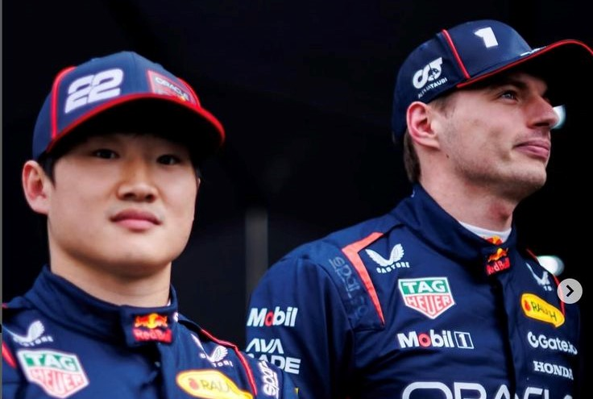
    

  
    

      

        <button class="btn-mercedes" onclick="window.open('https://www.mercedesamgf1.com', '_blank')">Mercedes-AMG F1</button>
        
Mercedes está en una etapa de transición, apostando fuerte por la juventud. Antonelli, de solo 18 años, ha generado titulares con un rendimiento sorprendente en su debut, mostrando temple y velocidad desde las primeras carreras. Russell, por su parte, ha asumido el rol de líder interno, pero también ha tenido que adaptarse a un auto con altibajos en ritmo de carrera. A pesar de algunos problemas de degradación, el equipo ha demostrado un progreso notable con respecto a 2024 y se mantiene regularmente en el podio.

      

      
    

  
    

      

        <button class="btn-ferrari" onclick="window.open('https://www.ferrari.com/en-EN/formula1', '_blank')">Scuderia Ferrari</button>
        
La llegada de Lewis Hamilton ha renovado las esperanzas de Ferrari. Su experiencia y ética de trabajo han sido claves para elevar el nivel interno del equipo. Leclerc ha seguido siendo muy rápido, aunque ha enfrentado cierta frustración con la falta de consistencia del auto en algunas pistas. El SF-25 es competitivo, pero aún muestra cierta inestabilidad en curvas lentas. El equipo de Maranello está comprometido en regresar al campeonato después de más de una década sin títulos, y este año están más cerca que nunca.

      

      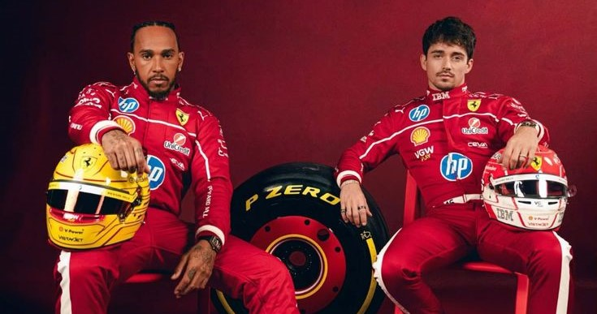
    

  
    

      

        <button class="btn-mclaren" onclick="window.open('https://www.mclaren.com/racing/', '_blank')">McLaren F1</button>
        
McLaren sigue consolidándose como uno de los principales rivales de Red Bull. Norris ha estado peleando por poles y victorias, mientras que Piastri, ya completamente asentado en F1, ha demostrado ser un respaldo fuerte para el equipo. El MCL39 ha destacado especialmente en circuitos técnicos y urbanos. El equipo ha hecho grandes avances en estrategia y desarrollo de neumáticos, lo que les ha permitido mantener un nivel alto durante las carreras largas. 

      

      
    

   
    

      

        <button class="btn-aston" onclick="window.open('https://www.astonmartinf1.com', '_blank')">Aston Martin F1</button>
        
Aston Martin ha tenido una temporada más difícil de lo previsto. Aunque Alonso continúa demostrando un nivel altísimo a sus 43 años, el rendimiento del AMR25 ha sido irregular. El coche sufre en clasificación, lo que condiciona mucho las carreras. Lance Stroll ha tenido resultados dispares, mientras el equipo sigue desarrollando piezas nuevas para mantenerse en la zona de puntos. Alonso ha pedido públicamente mejoras, y la inversión de Lawrence Stroll continúa siendo clave para el futuro de la escudería.

      

      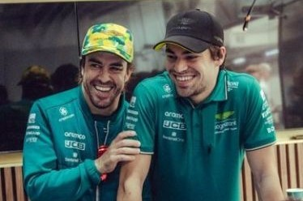
    

  
    

      

        <button class="btn-alpine" onclick="window.open('https://www.alpinecars.es/formula-1.html', '_blank')">Alpine F1</button>
        
Después de una temporada 2024 muy decepcionante, Alpine busca redención en 2025. Gasly ha tomado el liderazgo del equipo, mientras que Jack Doohan, proveniente de la F2, ha tenido un arranque difícil, pero muestra progresos carrera tras carrera. El chasis A525 ha mejorado en fiabilidad, aunque aún está lejos del rendimiento de la zona media-alta. La escudería francesa está en plena reestructuración técnica, con nuevos ingenieros clave llegando desde otros equipos. 

      

      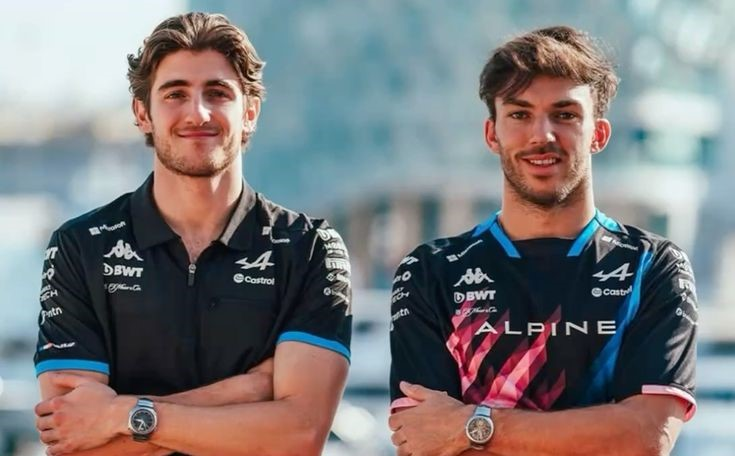
    

  
    

      

        <button class="btn-williams" onclick="window.open('https://www.williamsf1.com', '_blank')">Williams Racing</button>
        
La gran sorpresa de la temporada es la incorporación de Carlos Sainz, quien llegó desde Ferrari en busca de un nuevo reto. Williams ha hecho avances impresionantes en términos de aerodinámica y fiabilidad. Albon se ha convertido en una figura clave en el desarrollo, y con Sainz a bordo, el equipo ha conseguido varios resultados dentro del top 10. Aunque no luchan por podios todavía, están mucho más cerca del grupo medio alto que en años anteriores. 

      

      
    

  
    

      

        <button class="btn-sauber" onclick="window.open('https://www.sauber-group.com', '_blank')">Kick Sauber</button>
        
Sauber se encuentra en transición hacia su conversión en Audi F1 para 2026. Hülkenberg ha sido fichado por su consistencia y experiencia para liderar el equipo en esta fase de construcción. Gabriel Bortoleto, ex campeón de la F3, ha tenido una adaptación sólida en su primer año. El equipo tiene uno de los presupuestos más grandes fuera del top 4 y está invirtiendo en infraestructura y personal técnico de primer nivel para preparar la llegada de Audi.

      

      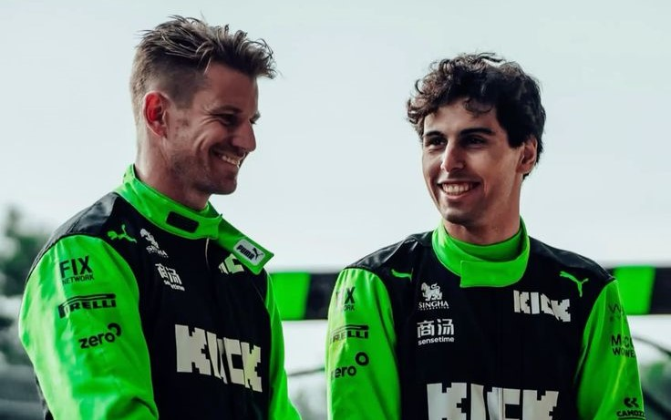
    

  
    

      

        <button class="btn-haas" onclick="window.open('https://www.haasf1team.com', '_blank')">Haas F1 Team</button>
        
Haas ha cambiado su enfoque con la contratación de Ocon, quien trae experiencia y estabilidad. El joven Oliver Bearman, que ya había impresionado con Ferrari como reemplazo temporal en 2024, ahora tiene su primera temporada completa y está adaptándose rápidamente. Aunque el VF-25 no es revolucionario, sí ha sido confiable, permitiendo al equipo recoger puntos regularmente. La estrategia y los pit stops, históricamente puntos débiles, han mejorado sustancialmente.

      

      
    

  
    

      

        <button class="btn-visacash" onclick="window.open('https://www.visacashapprb.com', '_blank')">Visa Cash App RB</button>
        
El renombrado equipo Racing Bulls ha apostado por un enfoque joven y atrevido. Tsunoda comenzó el año como piloto principal, pero luego fue llamado a Red Bull, dejando a Hadjar como líder del equipo. Hadjar, novato, está siendo evaluado con lupa por Helmut Marko y compañía. Aunque el coche no es de los más rápidos, ha sorprendido con buenos resultados en carreras caóticas. Racing Bulls se mantiene como una plataforma de desarrollo de talentos para Red Bull.

      

      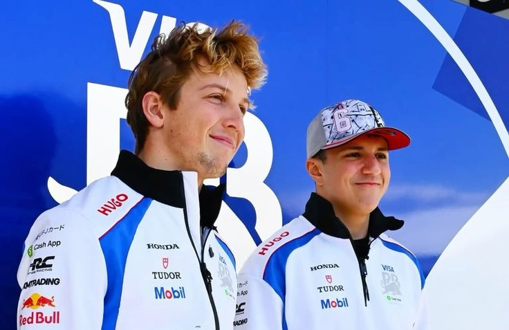
    

  </section>

  <section id="neumaticos" class="info-section">
    <h2>Tipos de Neumáticos</h2>
    
En Fórmula 1, los neumáticos juegan un papel clave, tanto como el coche o el piloto. Cada carrera se puede ganar o perder según cuándo y cómo uses los neumáticos. Pirelli, que es el proveedor oficial, trae seis tipos diferentes divididos en dos grandes grupos: los de seco y los de lluvia. 
  
    
Empezamos con los de seco, también llamados “slicks”: 

    
Estos son lisos, sin dibujo, porque están diseñados para ofrecer el máximo agarre posible cuando la pista está completamente seca. 
  
    
 Neumáticos duros (color blanco): Son los más resistentes. Tardan en calentarse, pero una vez que están a temperatura, duran muchas vueltas. Se usan cuando el asfalto es muy abrasivo o hace mucho calor. Son los que menos se desgastan, pero también los que menos agarre ofrecen 

    
Neumáticos medios (color amarillo): Son el equilibrio perfecto. Tienen buena duración y un agarre decente. Por eso, son los favoritos para la mayoría de estrategias de carrera. Van bien casi en cualquier circuito.

    
 Neumáticos blandos (color rojo):Estos son los más rápidos, pero también los que menos duran. Se calientan enseguida, así que dan un gran rendimiento en clasificación o al comienzo de la carrera, pero no aguantan tantas vueltas. Perfectos para circuitos urbanos o condiciones más frías.
  
    
Cuando la pista está mojada, los neumáticos lisos (slicks) ya no sirven, así que entran en juego dos tipos especiales con dibujo:

    
Intermedios (color verde):Se usan cuando la pista está húmeda o hay una llovizna ligera. También funcionan bien si la pista se va secando. Son muy versátiles, por eso son los más comunes en condiciones cambiantes.

    
Lluvia extrema (color azul):Aquí hablamos de agua de verdad. Si está lloviendo fuerte o hay charcos, estos son los que salvan el día. Pueden desplazar un montón de agua y evitar el temido aquaplaning.
  
    <h3>¿Cuándo se usan y cómo se eligen?</h3>
    
 Antes de cada carrera, Pirelli escoge los tres compuestos slicks más adecuados para ese circuito. Luego, durante el fin de semana, los equipos prueban y deciden su estrategia.

    
En carrera, cada piloto está obligado a usar al menos dos compuestos diferentes si la pista está seca, lo que significa que deben hacer al menos una parada.

    
Pero si llueve, esa regla se anula, y pueden usar solo intermedios o lluvia, según lo que necesiten.

    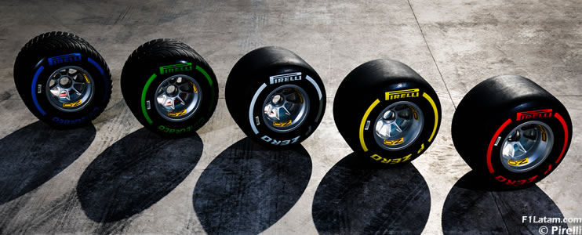    
  </section>

  <section id="circuitos" class="info-section">
    <h2>Circuitos 2025</h2>
    
 

    
Australia – Melbourne (14-16 de marzo): El Circuito de Albert Park es un trazado urbano que ofrece una mezcla de curvas cerradas y tramos rápidos, lo que lo convierte en un reto para los pilotos desde el principio de la temporada. A pesar de no ser un circuito particularmente largo, su asfalto cambia con el paso de la carrera, lo que obliga a los equipos a ajustar constantemente sus estrategias. La cercanía de las barreras aumenta el riesgo de errores. 
  
    
China – Shanghái (21-23 de marzo): El Circuito Internacional de Shanghái es famoso por su compleja combinación de largas rectas y curvas técnicas, siendo la curva 1 una de las más difíciles de todo el calendario. La pista es amplia, lo que permite múltiples líneas de adelantamiento, pero también exige una gran precisión en cada giro. La estrategia en Shanghái es crucial debido a sus exigentes condiciones para los neumáticos, y el clima impredecible puede alterar cualquier plan, lo que siempre aporta emoción a la carrera. 
  
    
Japón – Suzuka (4-6 de abril): Suzuka es considerado uno de los circuitos más exigentes y técnicos, con una secuencia de curvas rápidas como la "S" que requiere máxima precisión y control del coche. La famosa curva 130R desafía a los pilotos a mantener su velocidad en un giro de alta carga aerodinámica. Con un diseño que premia la destreza del conductor, Suzuka es un circuito que pone a prueba tanto la habilidad como la resistencia, y su ambiente apasionado lo convierte en una parada especial en el calendario. 
  
    
Baréin – Sakhir (11-13 de abril): El Circuito Internacional de Baréin es conocido por su clima cálido y su superficie abrasiva, lo que hace que el manejo de los neumáticos sea clave para el éxito. Su trazado, con largas rectas y curvas técnicas, permite varias oportunidades de adelantamiento, pero también requiere una gran concentración debido a su naturaleza técnica. Las condiciones extremas de calor y polvo a menudo complican las estrategias. 
  
    
Arabia Saudita – Jeddah (18-20 de abril): El Circuito Urbano de Jeddah es un trazado rápido y técnico que combina secciones rápidas con curvas cerradas muy cerca de las barreras. Con su diseño moderno, la pista ofrece múltiples oportunidades para adelantamientos, pero también requiere una gran precisión en cada giro debido a la cercanía de los muros. Al ser nocturna 
  
    
Estados Unidos – Miami (2-4 de mayo): El Circuito Urbano de Miami es un trazado moderno que mezcla largas rectas con curvas cerradas, ofreciendo tanto desafíos técnicos como oportunidades de adelantamiento. Su diseño permite una variedad de líneas de carrera, lo que resulta en emocionantes batallas en pista. 
  
    
Italia – Imola (16-18 de mayo): Imola es un circuito histórico conocido por su trazado técnico y desafiante. Con curvas como Acque Minerali y Variante Alta, exige mucha destreza de los pilotos, que deben mantener la concentración durante toda la carrera. 
  
    
Mónaco – Montecarlo (23-25 de mayo): El Circuito de Mónaco es el más emblemático de la F1, con su trazado urbano estrecho y sinuoso, donde adelantar es casi imposible. La calificación es clave en Mónaco, y los pilotos deben estar absolutamente concentrados para no cometer errores, ya que las barreras están muy cerca. 
  
    
España – Barcelona (30 de mayo – 1 de junio): El Circuito de Barcelona-Cataluña es conocido por su versatilidad, con una mezcla de curvas rápidas y secciones más técnicas que desafían a los pilotos a mantener un alto nivel de concentración. Las largas rectas permiten adelantamientos, pero las zonas más complejas requieren gran destreza y estrategia para no perder posiciones. Es un circuito que los equipos conocen bien y que favorece las estrategias de carrera inteligentes debido a su dificultad para pasar a otros coches. 
  
    
Canadá – Montreal (13-15 de junio): El Circuito Gilles Villeneuve es famoso por su diseño desafiante, con secciones rápidas y curvas cerradas que obligan a los pilotos a mantener un equilibrio entre agresividad y control. Las barreras cercanas aumentan el riesgo de cometer errores, lo que hace que la calificación sea esencial. 
  
    
Austria – Spielberg (27-29 de junio): El Red Bull Ring es un circuito corto pero técnico que ofrece desafíos en cada vuelta, con sus largas rectas seguidas de curvas de alta velocidad que requieren máxima precisión. Aunque el circuito es relativamente simple, las subidas y bajadas de su trazado requieren mucha habilidad para mantener el control del coche. 
  
    
Reino Unido – Silverstone (4-6 de julio): Silverstone es conocido como la "casa de la Fórmula 1" y es un circuito que ha formado parte del campeonato desde sus inicios. Con sus largas rectas y curvas de alta velocidad como Copse y Maggotts, los pilotos deben estar siempre alerta y ser extremadamente precisos. Las condiciones cambiantes del clima suelen ser un factor impredecible. 
  
    
Bélgica – Spa-Francorchamps (25-27 de julio): Spa es uno de los circuitos más legendarios de la F1, famoso por su clima impredecible y su diseño desafiante. La famosa Eau Rouge es una de las curvas más icónicas, exigiendo a los pilotos máxima confianza en sus coches. La larga recta de Kemmel ofrece excelentes oportunidades de adelantamiento, pero el resto del circuito, con sus curvas rápidas y su complejidad técnica, pone a prueba tanto la habilidad como la resistencia de los pilotos. 
  
    
Hungría – Budapest (1-3 de agosto): El Hungaroring es un circuito técnico con pocas oportunidades de adelantamiento, lo que lo convierte en un reto para los pilotos, que deben confiar en su estrategia y habilidad para posicionarse en la calificación. Las curvas lentas y el trazado estrecho requieren una precisión milimétrica, y las temperaturas altas suelen ser un factor importante que pone a prueba tanto a los coches como a los pilotos. La carrera en Hungría siempre es impredecible y ofrece emocionantes batallas tácticas. 
  
    
Países Bajos – Zandvoort (29-31 de agosto): Zandvoort es un circuito desafiante que combina secciones rápidas con curvas cerradas y un diseño muy técnico. La cercanía de las barreras aumenta el nivel de riesgo, mientras que la elevada dificultad en los adelantamientos hace que la calificación sea fundamental. 
  
    
Italia – Monza (5-7 de septiembre): Monza, conocido como el "Templo de la Velocidad", es el circuito más rápido del calendario, con largas rectas y pocas curvas que permiten a los coches alcanzar su máxima velocidad. Las emocionantes batallas por el liderazgo en la pista son habituales, pero la clave aquí es la velocidad pura y las estrategias de gestión de neumáticos. 
  
    
Azerbaiyán – Bakú (19-21 de septiembre): El Circuito Urbano de Bakú combina tramos urbanos con secciones de alta velocidad, ofreciendo un desafío único para los pilotos. Las oportunidades de adelantamiento son numerosas, pero las barreras cercanas y las curvas cerradas exigen gran precisión. A menudo, las carreras en Bakú son caóticas, con accidentes que alteran las posiciones y crean momentos espectaculares. 
  
    
Singapur – Marina Bay (3-5 de octubre): El Circuito Urbano de Singapur es uno de los más exigentes debido a su trazado estrecho y sinuoso, que deja poco espacio para los errores. Las altas temperaturas y la humedad también ponen a prueba la resistencia de los pilotos, quienes deben mantener su concentración a lo largo de toda la carrera. 
  
    
Estados Unidos – Austin (10-12 de octubre): El Circuito de las Américas en Austin es un trazado técnico que combina curvas rápidas con sectores más lentos, ofreciendo oportunidades para adelantamientos y maniobras arriesgadas. Su diseño desafiante y las amplias rectas permiten a los pilotos mostrar sus habilidades. 
  
    
México – Ciudad de México (24-26 de octubre): El Autódromo Hermanos Rodríguez es conocido por su altitud, lo que afecta la potencia de los coches y genera desafíos en cuanto a la gestión del motor. El circuito, con su mezcla de curvas rápidas y sectores lentos, permite a los pilotos atacar en la zona de adelantamientos, pero las altas temperaturas también juegan un papel importante en la estrategia. 
  
    
Las Vegas – Las Vegas (3-5 de noviembre): Las Vegas es uno de los circuitos más nuevos y espectaculares, con un trazado nocturno que atraviesa la famosa Strip. Las rectas largas y las curvas rápidas ofrecen oportunidades para adelantamientos, pero también exige mucha precisión debido a su diseño técnico. 
  
    
Brasil – São Paulo (14-16 de noviembre): El Circuito de Interlagos es conocido por su clima impredecible y su diseño desafiante, con una secuencia de curvas rápidas y subidas que requieren gran habilidad. Las oportunidades de adelantamiento son limitadas, lo que hace que la clasificación sea clave. 
  
    
Catar – Losail (21-23 de noviembre): El Circuito Internacional de Losail es una pista moderna y técnica que ha acogido varios momentos emocionantes en las últimas temporadas. Su trazado exige precisión, con largas rectas y curvas rápidas que desafían la velocidad y la estabilidad del coche. 
  
    
Abu Dabi – Yas Marina (5–7 de diciembre): El Yas Marina Circuit es una joya arquitectónica que combina velocidad, técnica y espectáculo nocturno. Con 58 vueltas y 16 curvas, este trazado urbano desafía a los pilotos con su mezcla de tramos rápidos y secciones técnicas. 
  
    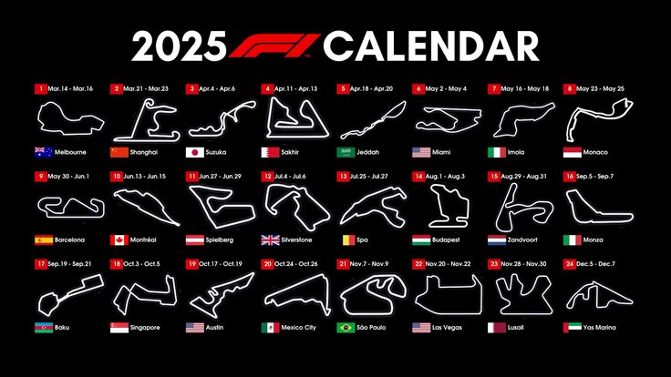
  </section>

  <section id="carrera" class="info-section">
    <h2>¿Cómo funciona un fin de semana de carrera?</h2>
    
Un fin de semana de Fórmula 1 arranca el viernes, que es el día más técnico y de preparación. Ese día los equipos y pilotos se enfocan en conocer el circuito, probar distintos ajustes en el auto y recopilar datos clave. Se hacen dos sesiones de práctica, donde los pilotos dan muchas vueltas con diferentes niveles de combustible y distintos compuestos de neumáticos. Lo que buscan es entender cómo se comporta el auto en distintas condiciones, cómo reacciona a los cambios de temperatura en la pista, y cuál podría ser la mejor estrategia para la carrera. Los ingenieros analizan todos esos datos para afinar la puesta a punto del coche, con el objetivo de que rinda lo mejor posible el resto del fin de semana.
  
    
El sábado comienza con una última sesión de práctica, más corta y enfocada. Ahí ya no se experimenta tanto: se prueban las configuraciones finales y se simulan vueltas rápidas, porque más tarde ese mismo día es la clasificación. La quali es intensa y estratégica, ya que define el orden de salida para la carrera del domingo. Está dividida en tres partes eliminatorias: primero corren todos, y los más lentos van quedando afuera en cada fase, hasta que los diez más rápidos se enfrentan por la pole position. Cada vuelta cuenta, porque salir adelante puede marcar la diferencia entre ganar o quedar atrapado en medio del pelotón. 
  
    
Y llega el domingo, el gran día, el momento en que todo se pone a prueba. Los autos se alinean en la parrilla según el resultado de la clasificación, después de dar una vuelta de formación para calentar neumáticos y frenos. Una vez que se apagan las luces, empieza la carrera, que puede durar hasta dos horas y está llena de emoción, estrategia y, a veces, caos. Los equipos deben tomar decisiones en tiempo real sobre cuándo parar en boxes, qué neumáticos usar, cómo reaccionar si hay un auto de seguridad o si cambia el clima. Todo esto mientras los pilotos compiten al límite vuelta tras vuelta. Al final, los diez primeros suman puntos, con 25 para el ganador, y si alguien dentro de ese top 10 marca la vuelta más rápida, se lleva un punto extra. 
  
    
Algunos fines de semana tienen una variante llamada Sprint, donde se corre una mini carrera el sábado y cambia un poco el orden de las sesiones. En ese formato, la clasificación pasa al viernes, la Sprint se corre el sábado (con puntos en juego pero menos que la carrera principal), y el domingo se mantiene la carrera larga y tradicional. 
  
    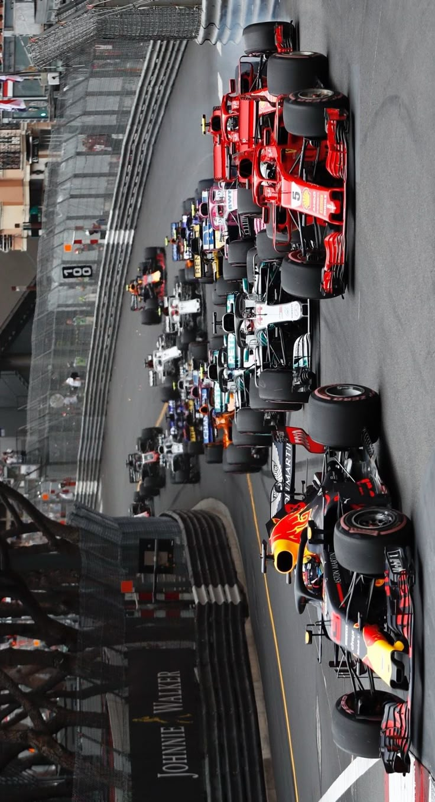
  </section>

  <section id="terminos" class="info-section">
    <h2>Términos Básicos</h2>
    
Pole Position: Es la primera posición en la parrilla de salida. El piloto que logra el mejor tiempo en la clasificación se gana este lugar. Salir desde la pole te da una ventaja porque estás adelante de todos y podés evitar el caos que suele haber en las primeras curvas.
  
    
Parrilla de salida (Grid): Es el orden en el que largan los autos el domingo, según los tiempos que hicieron en la clasificación. Se organiza en filas de a dos autos. 
  
    
Boxes (Pits): El lugar donde los autos entran durante la carrera para cambiar neumáticos, reparar algo o incluso abandonar si hay un problema serio. El equipo ahí es rapidísimo, pueden cambiar las cuatro ruedas en menos de 3 segundos. 
 
    
Pit Stop: La parada en boxes. Estratégicamente clave: elegir el momento justo para parar puede hacerte ganar o perder posiciones. 
 
    
Undercut: El undercut es cuando parás antes que tu rival y salís con neumáticos nuevos para ganar tiempo y superarlo cuando él pare. 
  
    
Overcut: El overcut es lo contrario: te quedás en pista más tiempo, confiando en que tus tiempos sean mejores que los del otro con neumáticos fríos o usados. 
  
    
DRS (Drag Reduction System): Un sistema que permite que el alerón trasero se abra en ciertas zonas del circuito, reduciendo la resistencia del aire y dándole al auto un extra de velocidad para facilitar los adelantamientos. Solo se puede usar si estás a menos de un segundo del auto que va adelante. 
  
    
Vuelta de formación: Es la vuelta que hacen antes de largar, para calentar neumáticos y frenos. Sirve también para chequear que todo esté bien con el auto. 
  
    
Safety Car: Cuando hay un accidente o algo peligroso en la pista, sale el auto de seguridad. Los pilotos deben ir detrás de él sin adelantarse, y la carrera se neutraliza. A veces esto cambia completamente el desarrollo de la carrera 
  
    
Virtual Safety Car (VSC): Similar al Safety Car, pero virtual: todos deben reducir la velocidad a un ritmo específico sin que entre un auto real a pista. Es como una pausa parcial. 
  
    
Parc Fermé: Es cuando los autos están bajo "custodia" después de la clasificación. No se les puede hacer casi ningún cambio. Esto es para que no haya trampas entre la quali y la carrera 
  
    
Setup: Es cómo se configura el auto: suspensión, altura, alerones, etc. Cada pista necesita un setup distinto, y cada piloto tiene su estilo, así que ajustan el coche para que se sienta cómodo y rápido. 
  
    
Tanda corta: pocas vueltas, con poco combustible y neumáticos nuevos, para buscar el mejor tiempo (como en clasificación). 
  
    
Tanda larga: muchas vueltas, simulando una carrera para ver cómo se comporta el auto con el paso del tiempo. 
  
    
Graining: cuando el caucho se desgasta de forma irregular y se forman como bolitas que hacen perder agarre. 
  
    
Blistering: cuando el neumático se recalienta y se forman burbujas que lo dañan. 
  
    
 

    
 

    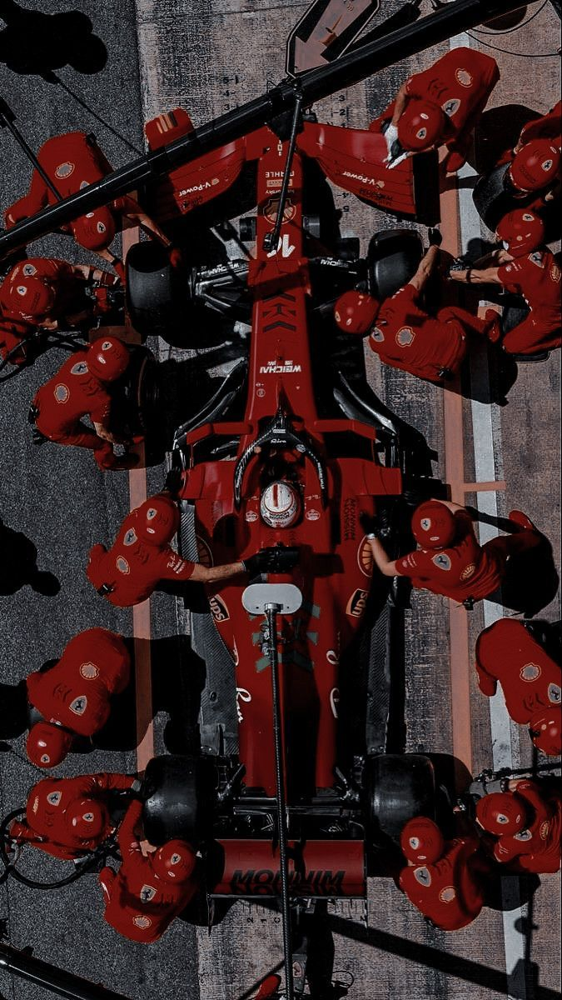
  </section>

  <section id="galeria" class="info-section">
    <h2>Galería de Imágenes</h2>
    

      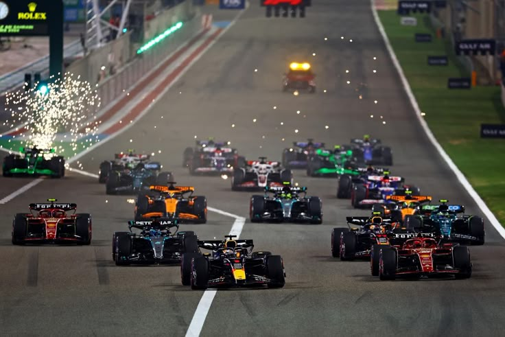
      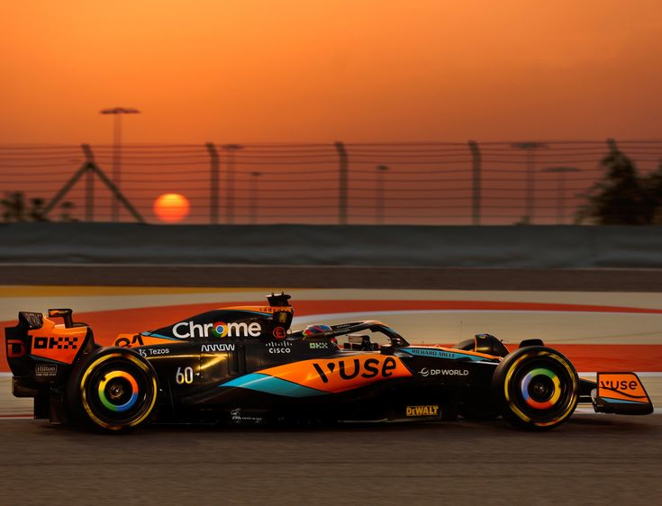
      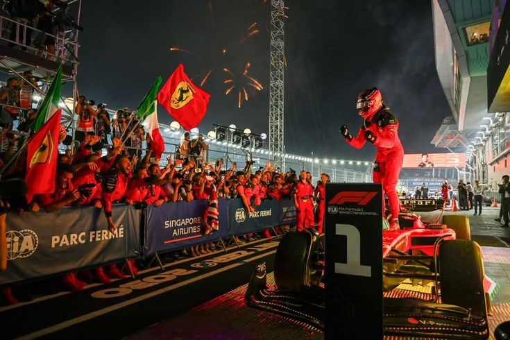
      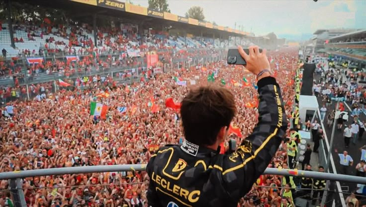
      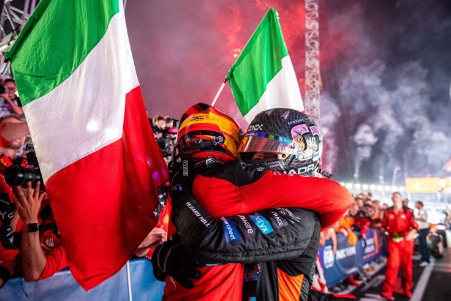
      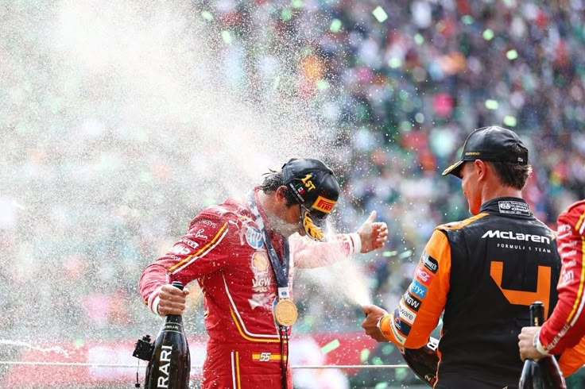
      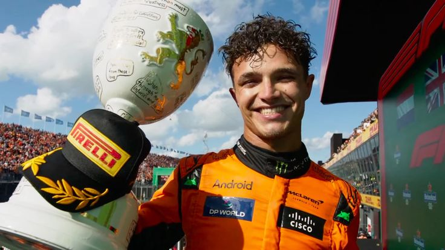
      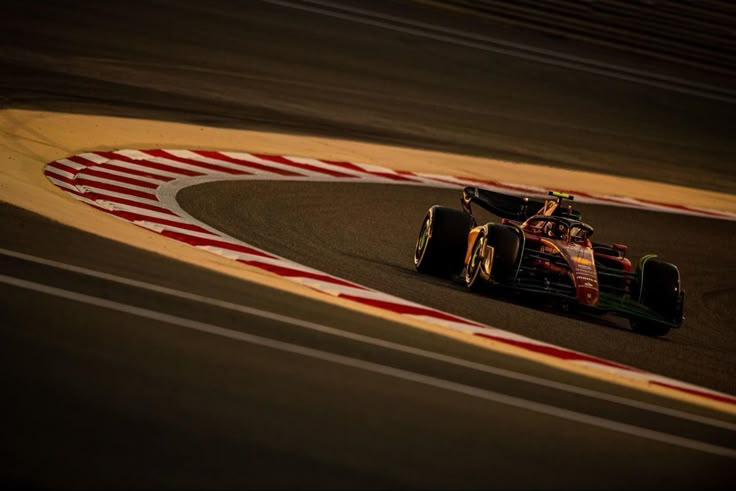
      
      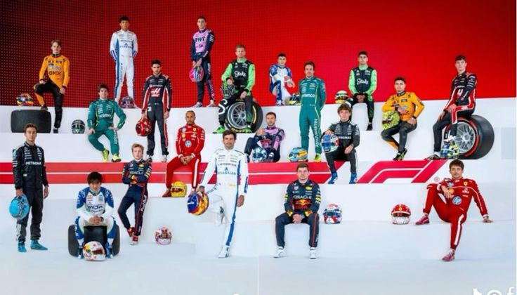
      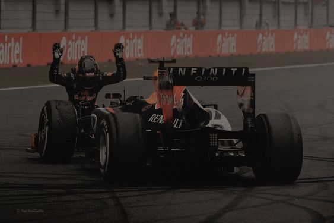
      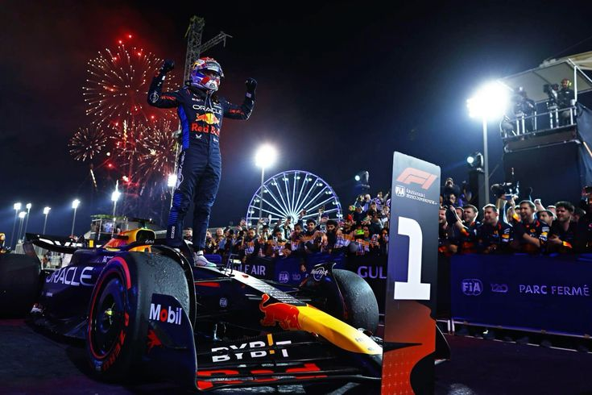
    

  </section>

  <footer>
    
 2025 Fórmula 1  | Patto 

  </footer>

  
</body>
</html>
